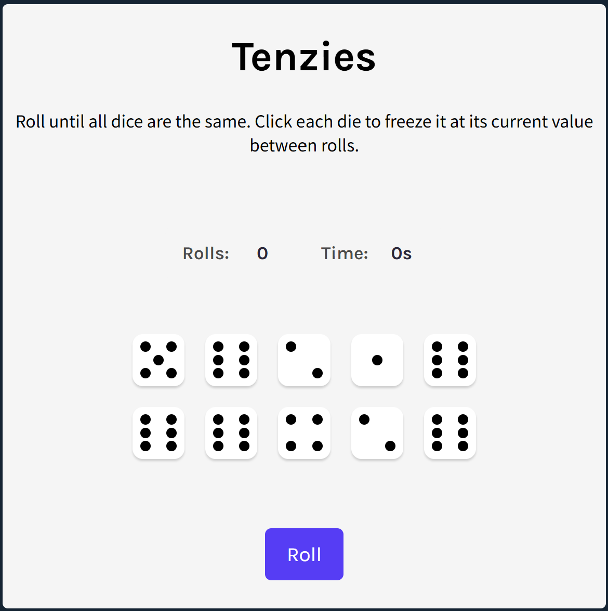

# Tenzies Game

A classic dice-rolling game built with React where the goal is to roll until all dice show the same number. Click individual dice to freeze them between rolls.
https://github.com/user-attachments/assets/d5ca17b9-ffbf-4eff-8f5a-0bba60a6fd57

## 🎲 Game Overview

Tenzies is an engaging single-player dice game where you roll 10 dice and try to get them all to display the same number. You can hold (freeze) specific dice while re-rolling the others to strategically achieve your goal.

### Live Demo
<a href="https://Gotham-Citizen.github.io/Tenzi">
  
</a>

Click the image above or [here](https://Gotham-Citizen.github.io/Tenzi) to play the game!

## ✨ Features

- **Interactive Dice**: Click any die to freeze/unfreeze it
- **Roll Counter**: Tracks how many rolls you've made
- **Timer**: Records how long you take to complete the game
- **Best Records**: Saves your best roll count and fastest time to localStorage
- **Win Celebration**: Confetti animation when you win
- **Keyboard Accessibility**: Focus management for better user experience
- **Responsive Design**: Works on desktop and mobile devices

## 🚀 Technologies Used

- **React** - UI framework
- **nanoid** - For generating unique die IDs
- **react-confetti** - Win celebration animation
- **CSS** - Custom styling

## 📦 Installation

1. Clone the repository:
```bash
git clone https://github.com/yourusername/Tenzi.git
```

2. Navigate to the project directory:
```bash
cd tenzies-game
```

3. Install dependencies:
```bash
npm install
```

4. Start the development server:
```bash
npm start
```

5. Open [http://localhost:3000](http://localhost:3000) in your browser

## 🎮 How to Play

1. **Start the Game**: Click the "Roll" button to roll all dice
2. **Hold Dice**: Click on any die to freeze it at its current value
3. **Roll Again**: Click "Roll" to re-roll unfrozen dice
4. **Win Condition**: Get all 10 dice showing the same number
5. **New Game**: After winning, click "New Game" to start fresh

### Tips
- Hold dice that match your target number
- Balance holding dice vs. rolling for better odds
- Check your stats to track improvement

## 🏆 Stats Tracking

The game automatically tracks:
- **Roll Count**: Number of rolls made in current game
- **Time**: Elapsed time since first roll
- **Best Rolls**: Your lowest roll count to win (saved in browser)
- **Best Time**: Your fastest win time (saved in browser)

## 🛠️ Project Structure

```
tenzies-game/
├── src/
│   ├── App.js          # Main game logic and UI
│   ├── components/
│   │   └── Die.js      # Individual die component
│   └── styles/
│       └── index.css   # Styling
├── public/
│   └── index.html
└── package.json
```

## 🔧 Component Breakdown

### App Component
- Manages game state (dice, timer, roll count)
- Handles win detection and best records
- Renders dice grid and controls

### Die Component
- Displays die value with visual representation
- Handles click events for holding/unholding
- Shows held state with visual feedback

## 🎨 Styling

The game features a clean, modern design with:
- Custom-styled dice with dot patterns
- Visual indicators for held dice
- Responsive layout

## ♿ Accessibility Features

- Focus management for keyboard navigation
- ARIA live regions for screen reader announcements
- Semantic HTML structure
- Keyboard-accessible controls

## 🙏 Acknowledgments

- Built as part of the [React learning journey](https://reactjs.org/)

---

**Happy Rolling! 🎲**